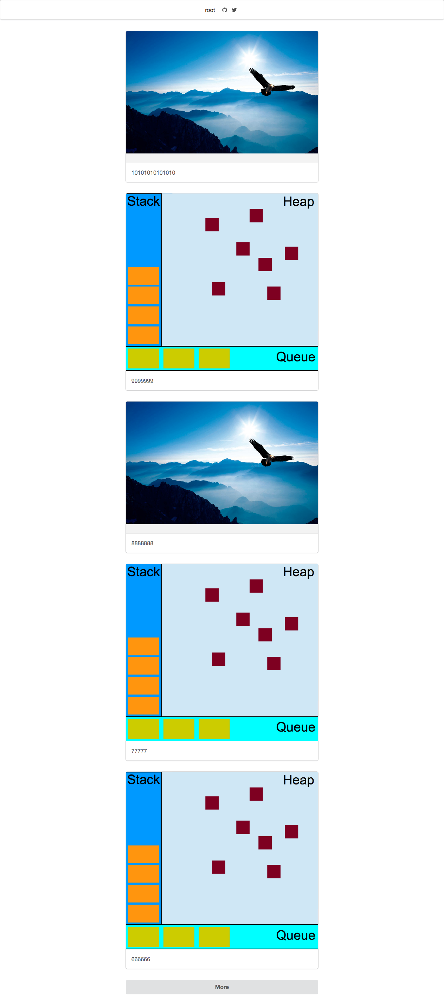
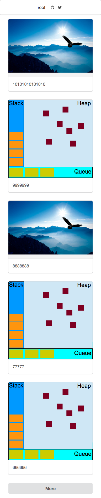
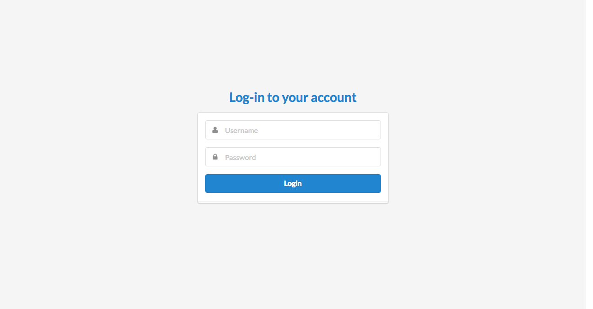
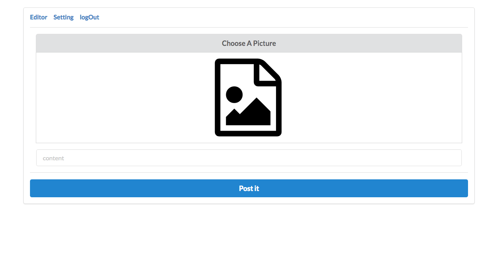
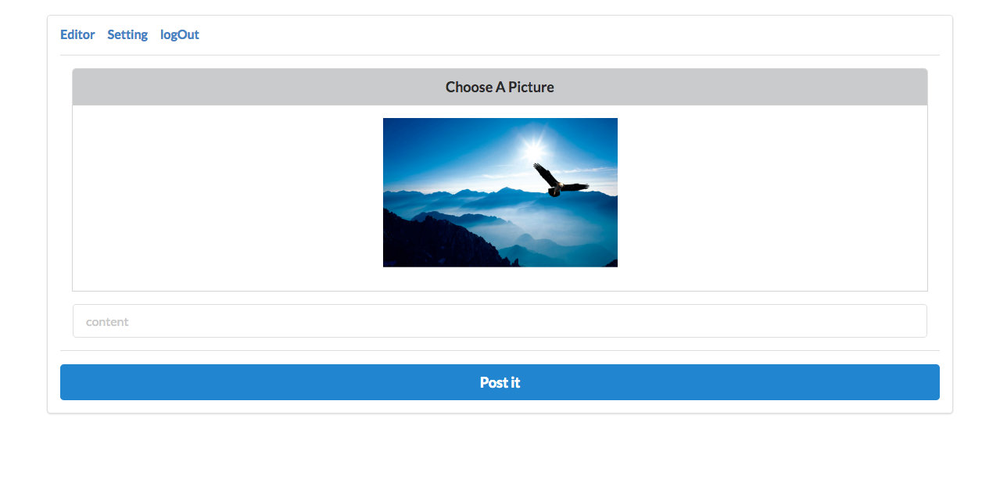
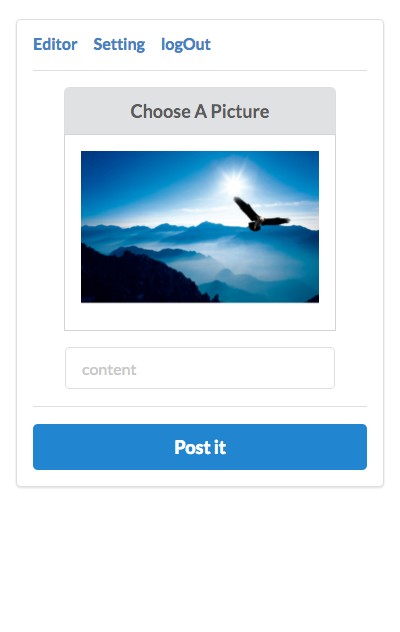
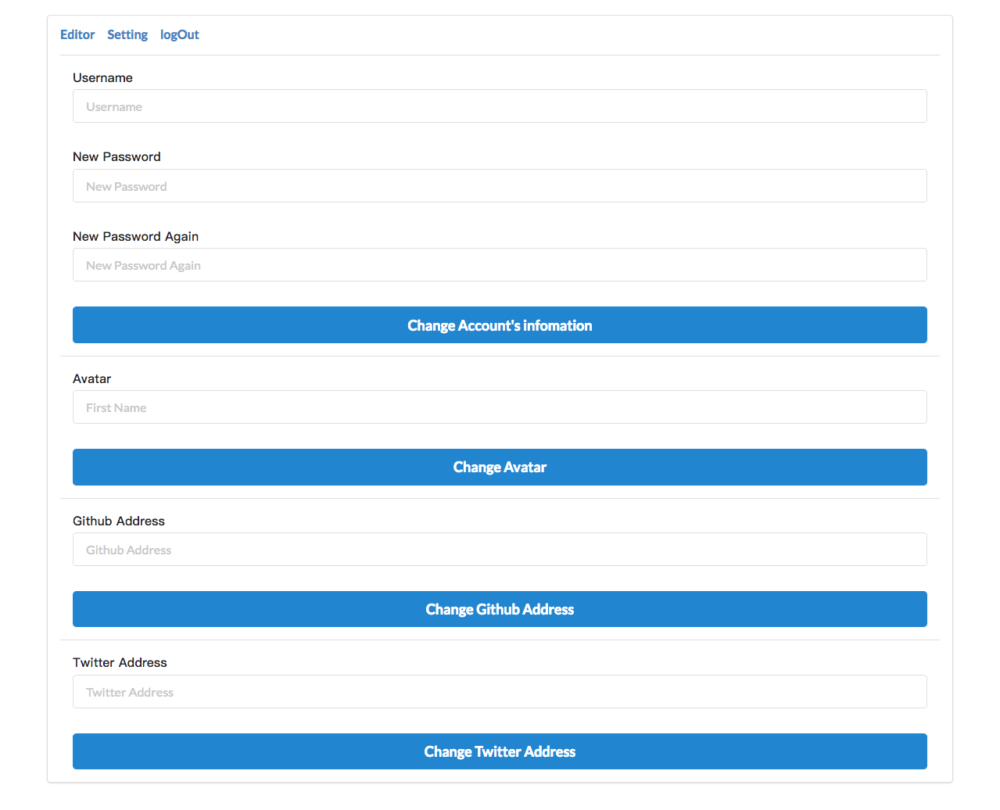
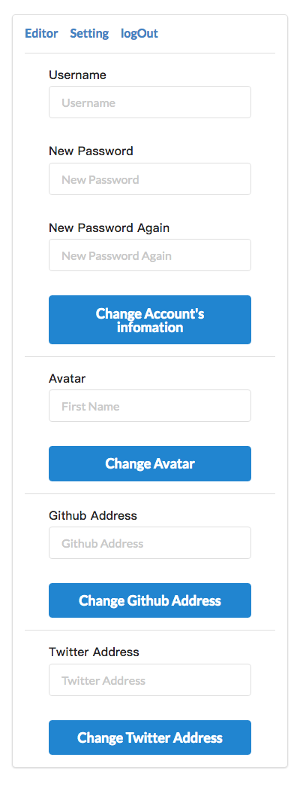

### Introductions
    This web app just like instagram, but less functions. Only single user picture blog.
    This app is licensed under a MIT license.


### Open Source license
>   1. Node.js [homepage](https://nodejs.org/en/) - [show license](https://raw.githubusercontent.com/nodejs/node/master/LICENSE)
>   2. Express.js [homepage](http://expressjs.com/) - [show license](https://github.com/expressjs/express/blob/master/LICENSE)
>   3. Sequelize.js [homepage](http://sequelizejs.com/) - [show license](https://github.com/sequelize/sequelize/blob/master/LICENSE)
>   4. Semantic-UI [homepage](http://semantic-ui.com/) - [show license](https://github.com/Semantic-Org/Semantic-UI/blob/master/LICENSE.md)
>   5. Vue.js [homepage](http://vuejs.org/) - [show license](https://github.com/vuejs/vue/blob/dev/LICENSE)
>   6. MySQL [homepage](http://www.mysql.com/) - [show license](http://www.gnu.org/licenses/old-licenses/gpl-2.0.html)
>   7. mysqljs [homepage](https://github.com/mysqljs/mysql) - [show license](https://github.com/mysqljs/mysql/blob/master/License)
>   8. EJS [homepage](http://ejs.co/) - [show license](https://github.com/mde/ejs/blob/master/LICENSE)

may be some open source project doesn't in this list.


### Installation

1. install Node.js v6.2.0+

2. npm install pm2 -g

3. install MySQL v5.7.11+ , and set the encoding to utf8

4. install nginx

5. git clone /link/to/this/program , and touch `config.json` in the program top level folder.
    ```javascript
        {
            "app": {
                "port": 9000,
                "host": "localhost",
                "timezone": "+08:00"
            },
            "db": {
                "type": "mysql",
                "username": "root",
                "password": "123456",
                "database": "insta",
                "host": "localhost",
                "port": 3306,
                "pool": {
                    "max": 5,
                    "min": 0,
                    "idle": 10000
                }
            }
        }
    ```

6. cd /path/to/this/program & npm install

7. cd /path/to/this/program/app/assets/page & npm install & npm run build

8. cd /path/to/this/program/app/assets/root & npm install & npm run build

9. start program using pm2, listening the local port, use nginx for reverse proxy

### The init account
    The initial account: {
        username: "root"
        password: "123456"
    }

### GUI

The following picture pictures may be a little different from the real programs

page interface, '/' or '/page' or '/index'  


page phone  


login interface, /login  


editor interface, /root#!/editor    


select image on pc  


select image on phone  


setting interface on pc  


setting interface on phone  


### Version 3 Features

1. Backup zip file encryption

2. Account infomations backup

3. All database fileds case sensitive

4. Image compression

5. Add favicon
